# CampusPulse

CampusPulse is a web-based placement management and analytics platform designed to centralize and simplify the placement activities of students, companies, and placement administrators.

The platform provides role-based access for students, TPOs, and administrators to manage student profiles, skills, resumes, companies, job opportunities, applications, interviews, placement offers, and placement analytics.

## Live Project

* **Frontend:** https://campuspulse-frontend-25yx.onrender.com/
* **Backend API:** https://campuspulse-backend-uzum.onrender.com/
* **GitHub Repository:** https://github.com/ritesh-mandal-ui/CampusPulse

## Project Overview

Traditional placement processes often involve maintaining student information, job opportunities, applications, interview schedules, and placement records across multiple spreadsheets or disconnected systems.

CampusPulse brings these activities together into a centralized web application.

The system provides:

* Student management
* Company management
* Job management
* Application tracking
* Interview management
* Placement offer management
* Web-based placement analytics
* Microsoft Power BI analytics
* JWT-based authentication
* Role-based access control
* Resume upload and management
* PostgreSQL database integration

## Key Features

### Student Module

Students can:

* Register and authenticate
* View and manage their profile
* View department and academic information
* Add and manage skills
* Upload resumes
* View available job opportunities
* Apply for eligible jobs
* Track application status
* View scheduled interviews
* View placement offers

### Company Management

TPO/Admin users can:

* Add companies
* Manage company information
* Associate companies with job opportunities
* View company-related placement information

### Job Management

The job management module supports:

* Creating job opportunities
* Updating job information
* Managing company associations
* Defining eligibility requirements
* Managing salary/package information
* Viewing available jobs
* Tracking job applications

### Application Management

Students can apply for available jobs and track their applications.

TPO/Admin users can manage application records and update application statuses.

Supported application statuses:

* `APPLIED`
* `SHORTLISTED`
* `INTERVIEW`
* `SELECTED`
* `REJECTED`
* `WITHDRAWN`

### Interview Management

The interview module supports:

* Scheduling interviews
* Managing interview information
* Online and offline interview modes
* Tracking interview results

Supported interview results:

* `PENDING`
* `PASSED`
* `FAILED`

### Offer Management

TPO/Admin users can create placement offers for selected applications.

The module stores:

* Student information
* Company information
* Job information
* Salary/package information
* Offer date
* Offer status

Supported offer statuses:

* `ACTIVE`
* `ACCEPTED`
* `DECLINED`

## Placement Analytics

CampusPulse provides analytics through both the web application and Microsoft Power BI.

### Web Analytics

The web analytics module provides:

* Total students
* Total companies
* Total jobs
* Total applications
* Total offers
* Selected students
* Placement rate
* Application status distribution
* Company-wise placement information

### Power BI Analytics

The CampusPulse Power BI dashboard provides placement insights using:

* Applications by Status
* Jobs by Company
* Students by Department
* Student Skill Analysis
* Applications by Company
* Application Trend over Time
* Offers by Company
* Interview Results
* Jobs by Industry
* Average Salary by Company
* Applications by Job
* Job Status Analysis

## Technology Stack

### Frontend

* HTML5
* CSS3
* JavaScript

### Backend

* Python
* Flask
* Flask-SQLAlchemy
* Flask-CORS
* PyJWT
* bcrypt
* python-dotenv
* Gunicorn

### Database

* PostgreSQL
* SQLAlchemy ORM
* Aiven PostgreSQL for production

### Analytics

* Microsoft Power BI
* CampusPulse Web Analytics

### Deployment

* GitHub
* Render
* Aiven PostgreSQL

## Authentication and Authorization

CampusPulse uses JWT-based authentication for protected API endpoints.

User passwords are securely hashed using bcrypt before being stored in the database.

After successful authentication, the backend generates a JWT token containing the authenticated user's information and role.

Protected API requests use:

```text
Authorization: Bearer <token>
```

Role-based access control is used to restrict functionality according to the user's role.

## User Roles

### STUDENT

Students can:

* Manage their profile
* Upload and manage their resume
* Manage their skills
* Browse jobs
* Apply for jobs
* Track applications
* View interviews
* View placement offers

### TPO

TPO users can:

* Manage companies
* Manage jobs
* Manage applications
* Manage interviews
* Manage offers
* View placement analytics

### ADMIN

Administrators can manage:

* Companies
* Jobs
* Applications
* Interviews
* Offers
* Placement analytics

### SUPER_ADMIN

Super Admin functionality is supported by the backend for administrative access.

## API Structure

The Flask backend is organized into modular route blueprints.

### Authentication

```text
/api/auth
```

Operations include:

```text
POST /api/auth/register
POST /api/auth/login
GET  /api/auth/me
```

### Students

```text
/api/students
```

Handles student profiles, resumes, and student-related information.

### Companies

```text
/api/companies
```

Handles company information and company management.

### Jobs

```text
/api/jobs
```

Handles job opportunities and job management.

### Applications

```text
/api/applications
```

Handles job applications and application status management.

### Interviews

```text
/api/interviews
```

Handles interview scheduling and interview results.

### Offers

```text
/api/offers
```

Handles placement offers.

### Analytics

```text
/api/analytics
```

Provides placement summaries, application-status analytics, and company placement information.

### Public Summary

```text
/api/public/summary
```

Provides public platform statistics used by the CampusPulse landing page.

## Database

CampusPulse uses PostgreSQL with SQLAlchemy ORM.

The major database entities include:

* Users
* Students
* Departments
* Companies
* Jobs
* Applications
* Interviews
* Offers
* Skills
* Student Skills

The production database is hosted using Aiven PostgreSQL.

## System Architecture

```text
                    CampusPulse
                         |
        +----------------+----------------+
        |                                 |
   Web Frontend                       Power BI
 HTML / CSS / JS                    Analytics
        |
        | HTTPS API Requests
        v
   Flask Backend
        |
   +----+----+
   |         |
 JWT Auth  REST APIs
   |         |
   +----+----+
        |
        v
 PostgreSQL
   Aiven DB
```

## Project Structure

```text
CampusPulse/
├── backend/
│   ├── app.py
│   ├── config.py
│   ├── extensions.py
│   ├── models/
│   │   ├── application.py
│   │   ├── company.py
│   │   ├── department.py
│   │   ├── interview.py
│   │   ├── job.py
│   │   ├── offer.py
│   │   ├── skill.py
│   │   ├── student.py
│   │   ├── student_skill.py
│   │   └── user.py
│   ├── routes/
│   │   ├── analytics.py
│   │   ├── applications.py
│   │   ├── auth.py
│   │   ├── companies.py
│   │   ├── interviews.py
│   │   ├── jobs.py
│   │   ├── offers.py
│   │   ├── public.py
│   │   └── students.py
│   └── utils/
│       └── decorators.py
│
├── database/
│   ├── schema.sql
│   ├── seed.sql
│   └── queries.sql
│
├── docs/
│   └── screenshots/
│
├── frontend/
│   ├── css/
│   │   ├── landing.css
│   │   └── style.css
│   ├── js/
│   │   ├── auth.js
│   │   └── landing.js
│   ├── index.html
│   └── pages/
│       ├── login.html
│       ├── register.html
│       ├── student-dashboard.html
│       ├── student-profile.html
│       ├── student-skills.html
│       ├── student-jobs.html
│       ├── student-application.html
│       ├── student-interviews.html
│       ├── student-offers.html
│       ├── admin-dashboard.html
│       ├── admin-companies.html
│       ├── admin-jobs.html
│       ├── admin-applications.html
│       ├── admin-interviews.html
│       ├── admin-offers.html
│       └── admin-analytics.html
│
├── powerbi/
├── tests/
├── CampusPulse_Analytics.pbix
├── requirements.txt
├── .gitignore
└── README.md
```

## Running Locally

### 1. Clone the repository

```bash
git clone https://github.com/ritesh-mandal-ui/CampusPulse.git
cd CampusPulse
```

### 2. Create and activate the virtual environment

Windows PowerShell:

```powershell
python -m venv venv
.\venv\Scripts\Activate.ps1
```

### 3. Install dependencies

```powershell
pip install -r requirements.txt
```

### 4. Configure environment variables

Create a `.env` file with the required database and application configuration.

```text
DATABASE_URL=<your-postgresql-database-url>
SECRET_KEY=<your-secret-key>
```

Do not commit `.env` or database credentials to GitHub.

### 5. Run the backend

```powershell
python .\backend\app.py
```

The backend runs locally on:

```text
http://127.0.0.1:5000
```

### 6. Run the frontend

In another terminal:

```powershell
python -m http.server 5501 --directory frontend
```

Open:

```text
http://127.0.0.1:5501/
```

## Production Deployment

### Backend

The Flask backend is deployed on Render using Gunicorn.

```text
https://campuspulse-backend-uzum.onrender.com
```

### Frontend

The static frontend is deployed on Render.

```text
https://campuspulse-frontend-25yx.onrender.com/
```

### Database

The production PostgreSQL database is hosted on Aiven.

The backend connects to the production database through the configured `DATABASE_URL`.

## Screenshots

### Landing Page

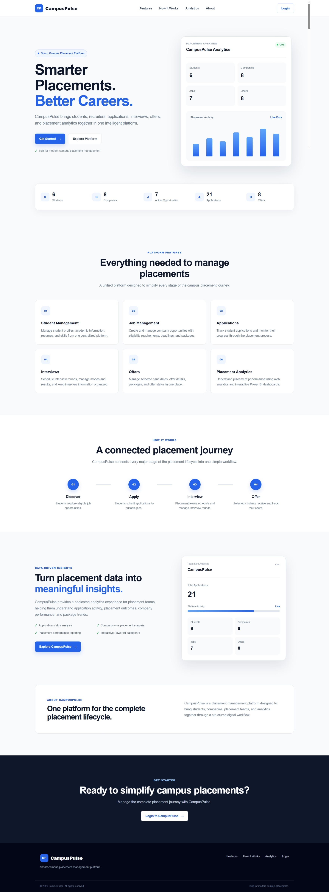

### Login Page

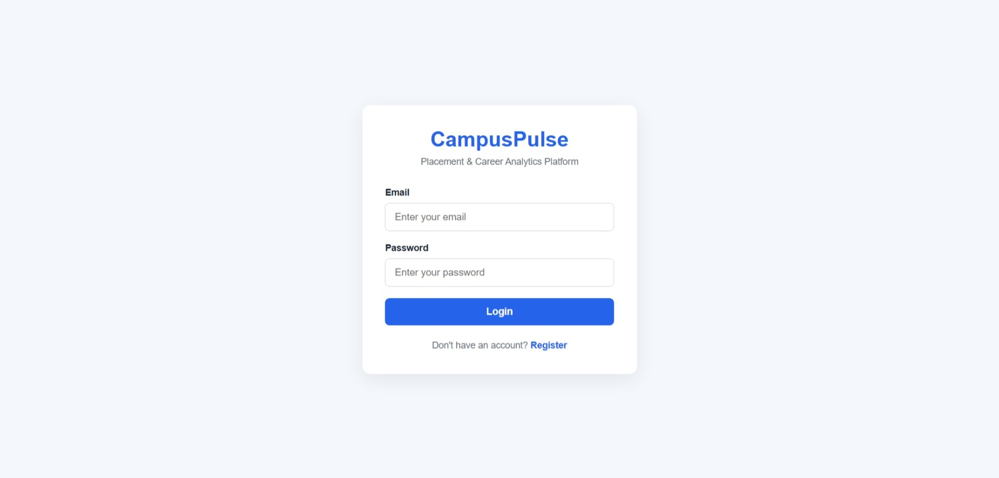

### Student Dashboard

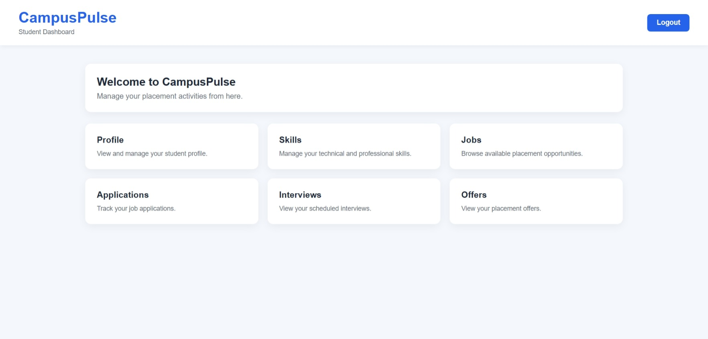

### Student Profile

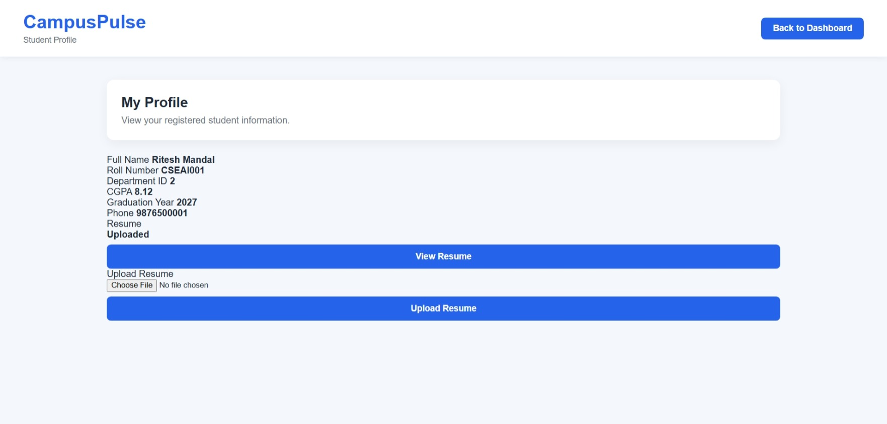

### Student Jobs

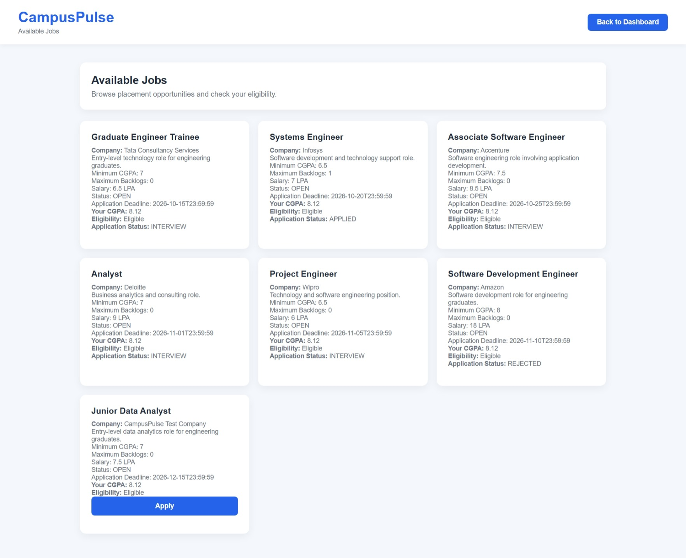

### Student Applications

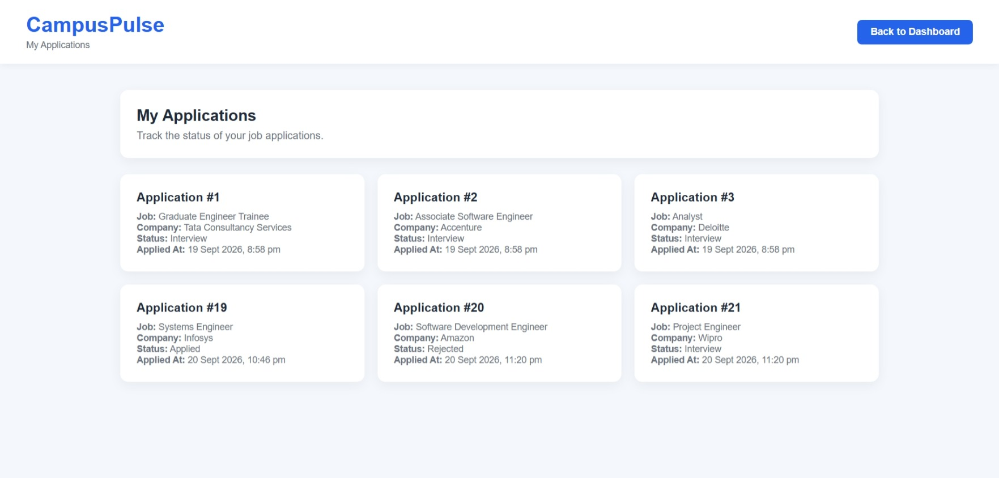

### Student Interviews

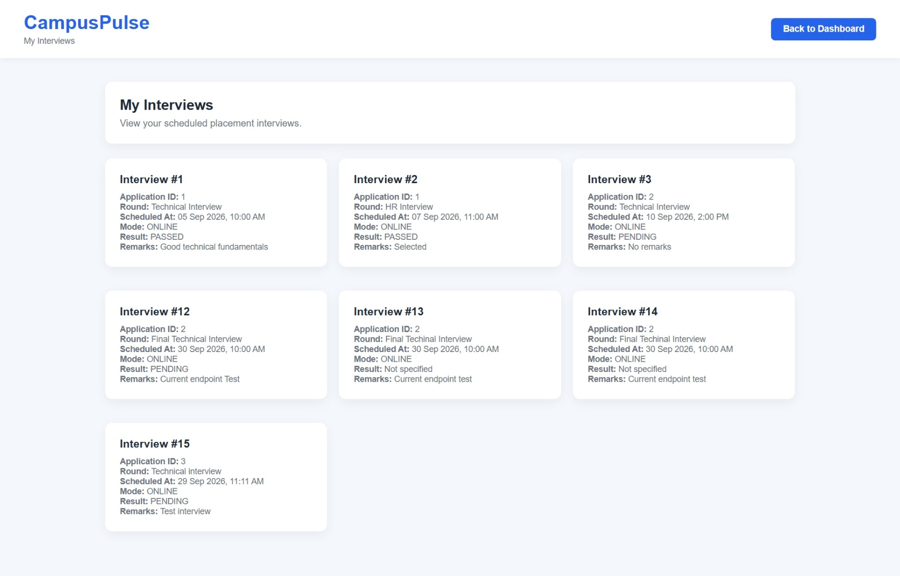

### Student Offers

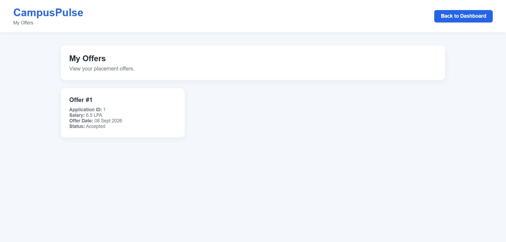

### TPO Dashboard

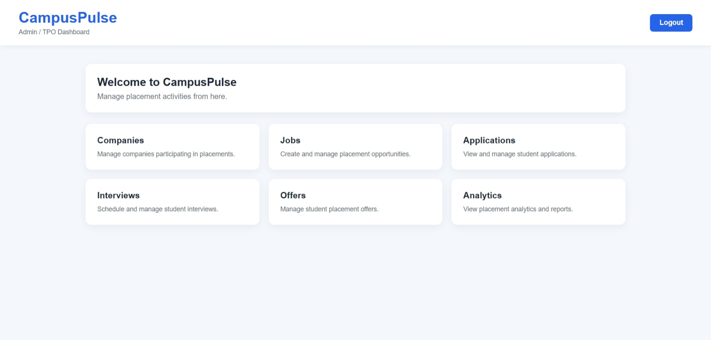

### Job Management

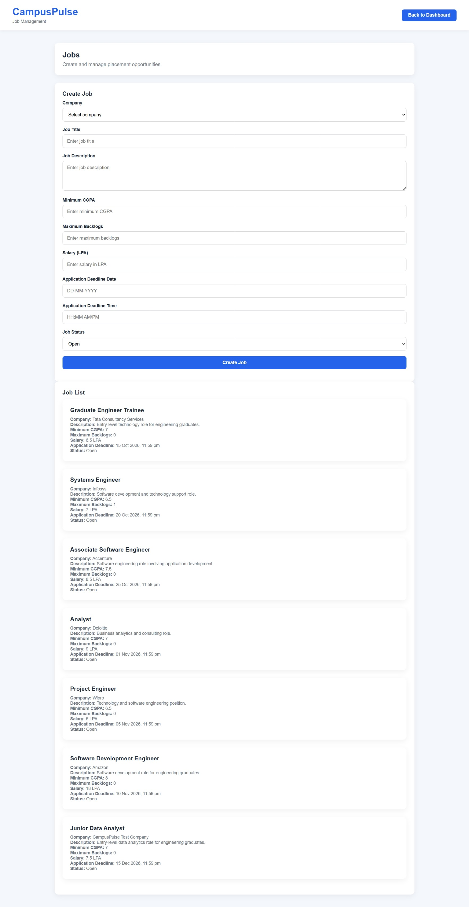

### Application Management

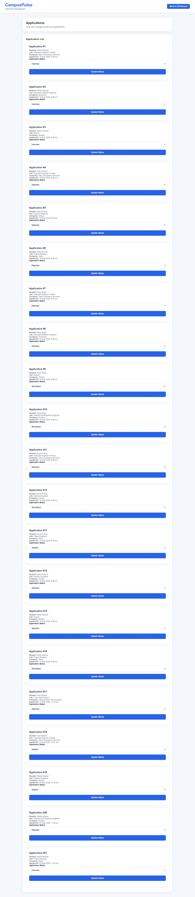

### Interview Management

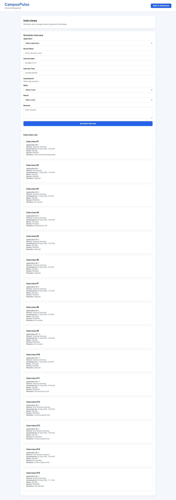

### Offer Management

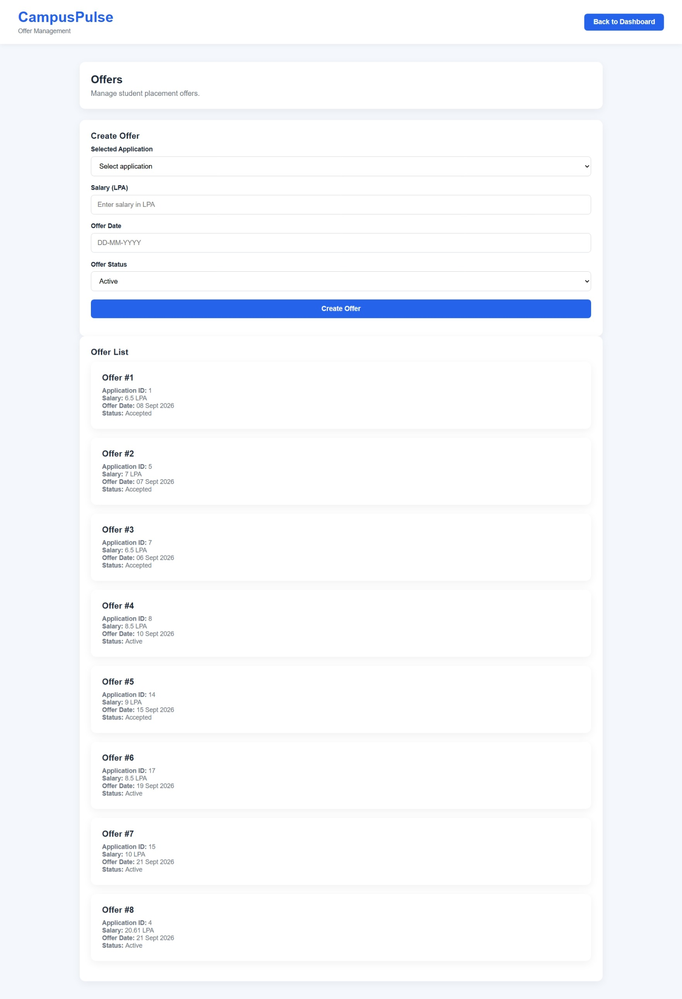

### Web Analytics

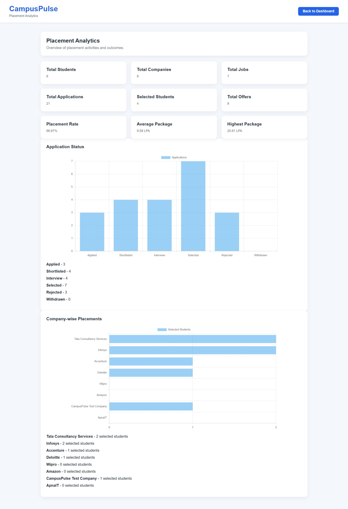

### Power BI Dashboard

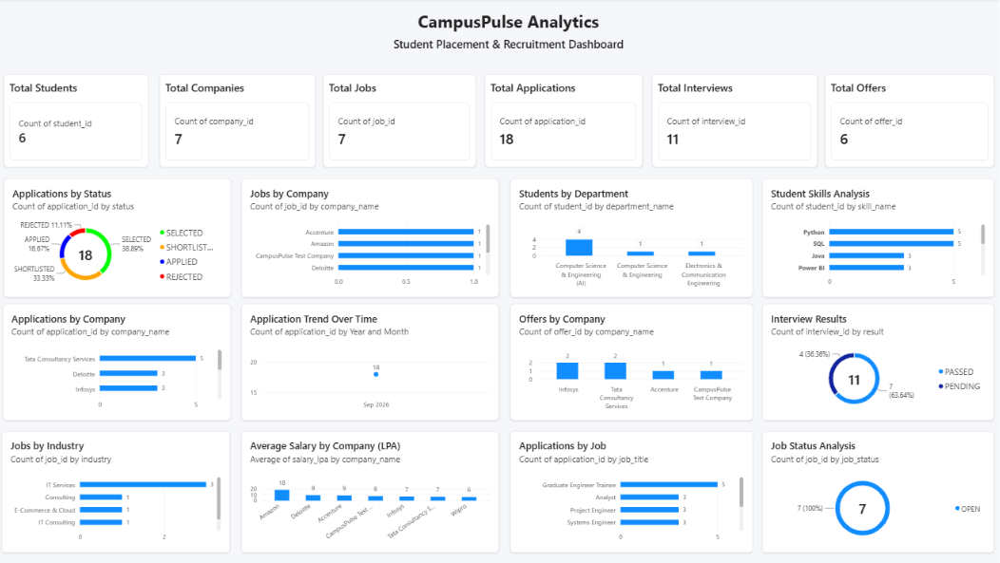

## Future Enhancements

Possible future improvements include:

* Email notifications for application and interview updates
* Advanced job eligibility validation
* Automated placement reports
* More advanced analytics and filtering
* Student placement history
* Company-wise recruitment trends
* Automated interview reminders
* Improved mobile optimization
* Additional dashboard visualizations
* Advanced role and permission management

## Project Status

CampusPulse currently provides a complete working placement-management workflow covering:

* Student management
* Skill management
* Resume management
* Company management
* Job management
* Application management
* Interview management
* Offer management
* Web analytics
* Power BI analytics
* JWT authentication
* Role-based authorization
* Production deployment

## License

This project is developed for educational and portfolio purposes.
